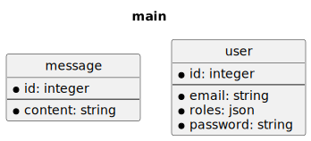

# survos-sites/htmx-demo

## Installation

```bash
git clone git@github.com:survos-sites/htmx-demo htmx-demo && cd htmx-demo
echo "DATABASE_URL=sqlite:///%kernel.project_dir%/var/data.db" > .env.local
echo "DATABASE_URL=sqlite:///%kernel.project_dir%/var/data_test.db" > .env.test
composer install
bin/console doctrine:schema:update --force
symfony server:start -d
symfony open:local
```


## Running tests

```bash
bin/console doctrine:schema:update --force --env=test
bin/console doctrine:fixtures:load -n --env=test
vendor/bin/phpunit
```


    usage here.

## Database




# HTMX Demo / Playground

This is the source code for the blog post at https://jolicode.com/blog/making-a-single-page-application-with-htmx-and-symfony

## Requirements

- Symfony CLI
- Docker
- PHP ^8.2

## Run the project

```shell
composer install
docker compose up -d
symfony console importmap:install
symfony console doctrine:schema:create
symfony console tailwind:build
symfony server:start -d
symfony open:local
```

Website is available on https://127.0.0.1:8000.

## Database


*build with survos/doc-bundle*
